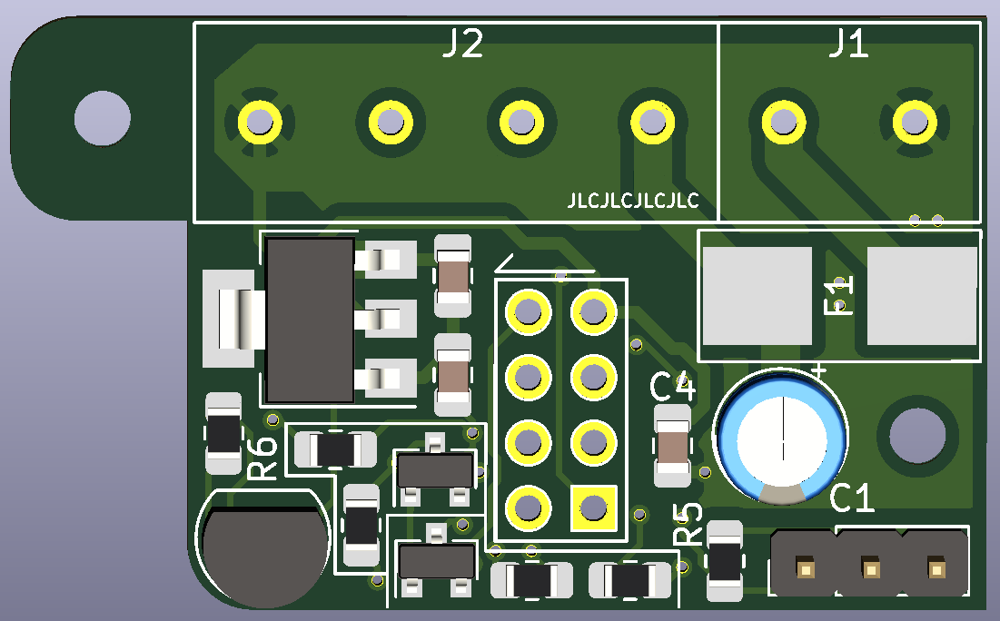
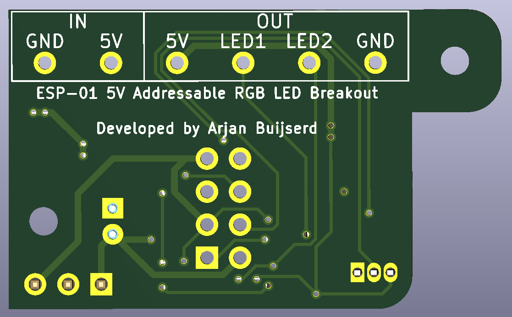

## Introduction
This repo documents the development of a small ESP-01 breakout board to support controlling two WS2812B LED strips and a Dallas DS18B20 temperature sensor. This allows for easy integration with HomeAssistant through ESPHome. 

Note that I'm just developing this stuff in my spare time and I'm far from an expert. Development may be slow and I cannot make any promises on the quality of this board. However, feel free to look around, maybe there's something useful for you in there!

## Hardware Overview
A schematic overview of the breakout board can be found [here](Hardware/esp01-ws2812b-breakout.pdf). As an be seen, this simple board allows to fit an ESP-01. Furthermore, it contains two level-shifters to control 5V data lines. The board is prepared to mount a DS18B20 temperature sensor, if desired. Lastly, a header to interface with the GPIO0 pin can be added, to further expand this board.

The layout and routing of V1 are finished:

(Note: the cutout in the lower left section aims to provide clearance for the WiFi antenna to improve the ESP's WiFi range.)

